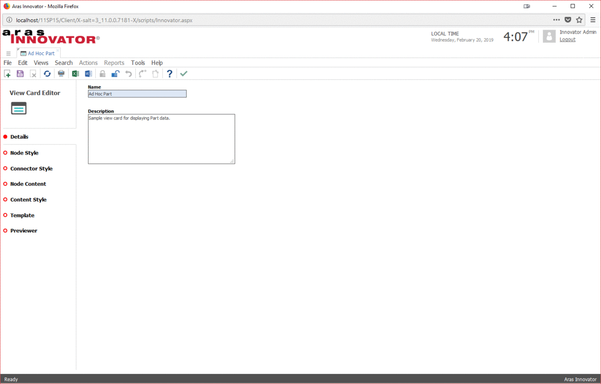
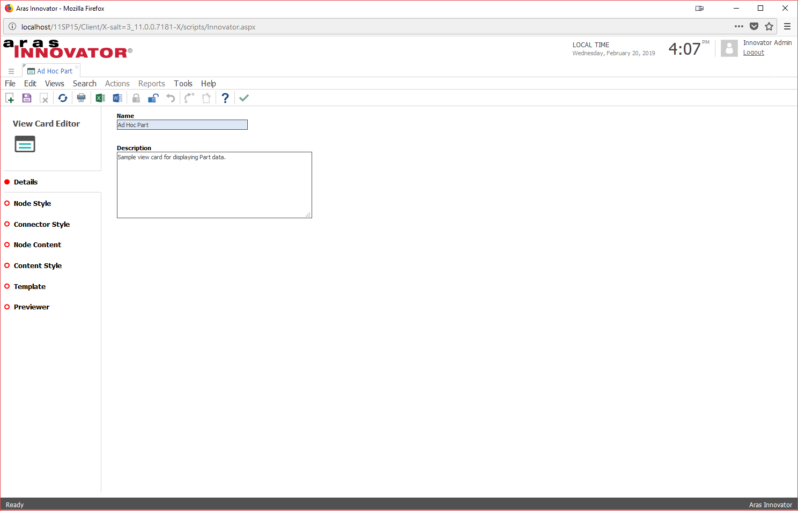
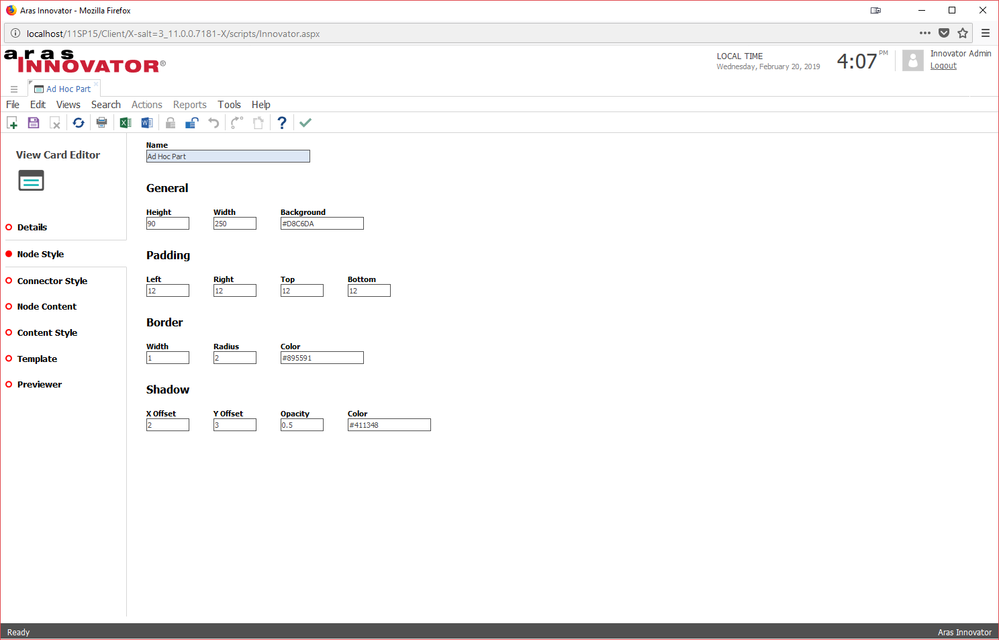
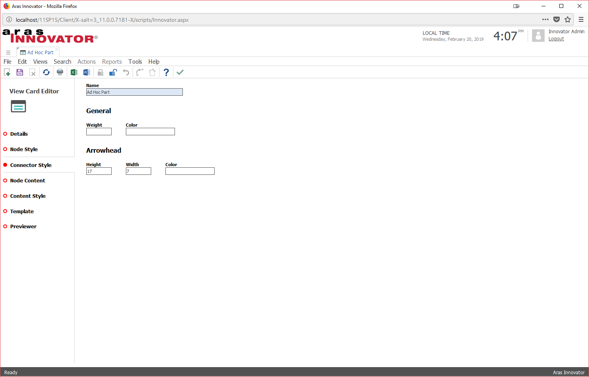
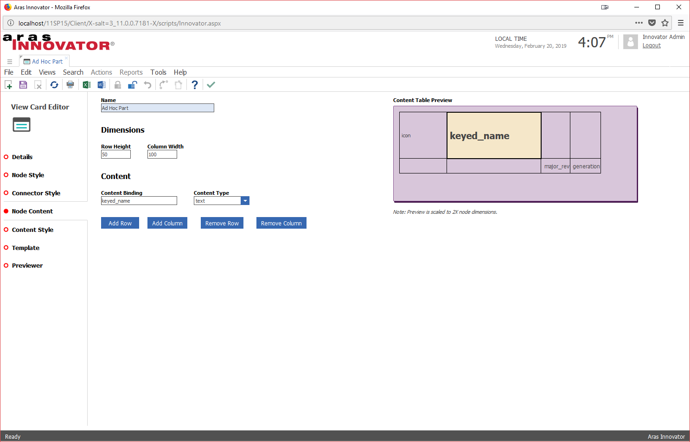
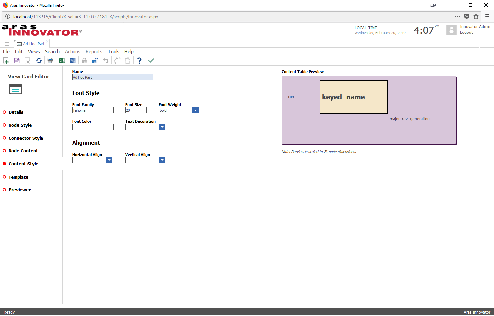
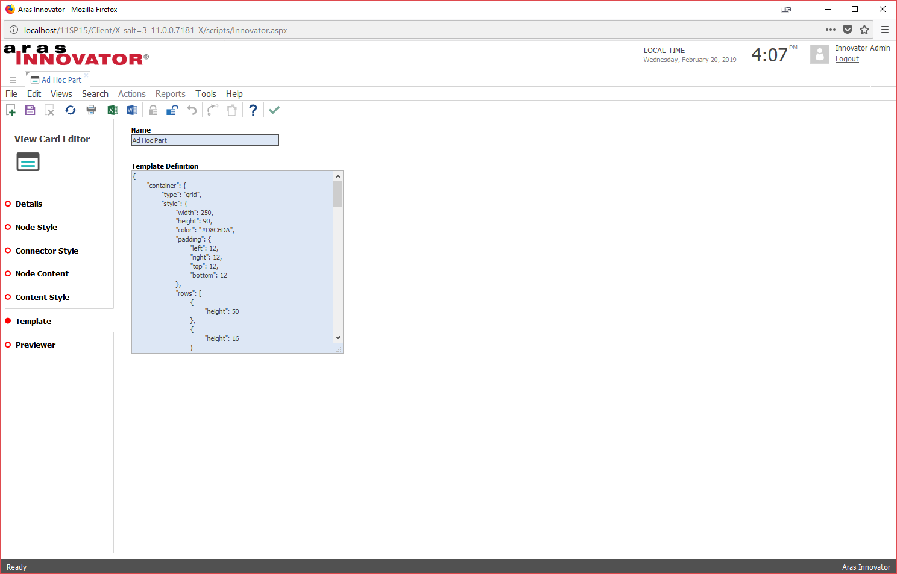
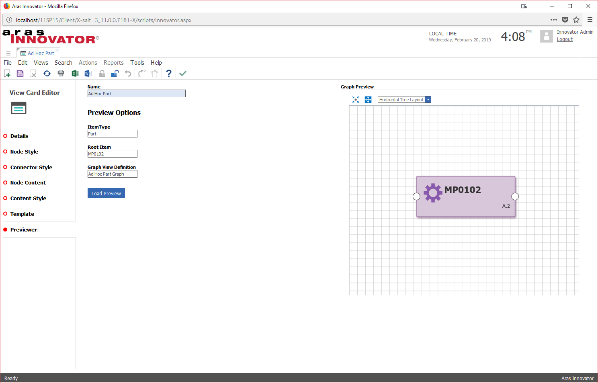

# View Card Editor for Aras Graph Navigation

This project provides an alternate GUI for editing the View Cards used by Aras Graph Navigation. Instead of directly editing JSON to define the style, structure, and content of the View Card, admins can use a custom form and content editor with an embedded previewer.

### Features
* Quick Start: Creating a new View Card pre-populates the template with some basic settings to help you get started quickly.
* Content Editor: A WYSIWYG editor provides a GUI for editing the table layout, content binding, and content styles for the View Card.
* Graph Previewer: An embedded previewer lets you view your changes in a live graph view without leaving the View Card form.

## History

Release | Notes
--------|--------
[v1.0.1](https://github.com/ArasLabs/view-card-editor/releases/tag/v1.0.1) | Form updated for Innovator 12.0.
[v1.0.0](https://github.com/ArasLabs/view-card-editor/releases/tag/v1.0.0) | First release.

#### Supported Aras Versions

Project | Aras
--------|------
[v1.0.1](https://github.com/ArasLabs/view-card-editor/releases/tag/v1.0.1) | 11.0 SP15, 12.0
[v1.0.0](https://github.com/ArasLabs/view-card-editor/releases/tag/v1.0.0) | 11.0 SP15

## Installation

#### Important!
**Always back up your code tree and database before applying an import package or code tree patch!**

### Pre-requisites

1. Aras Innovator installed
2. Aras Package Import Utility
3. aras.labs.graph_nav.editor package

### Install Steps

1. Backup your database and store the BAK file in a safe place.
2. Open up the Aras Package Import tool.
3. Enter your login credentials and click **Login**
    * _Note: You must login as root for the package import to succeed!_
4. Enter the package name in the TargetRelease field.
    * Optional: Enter a description in the Description field.
5. Enter the path to your local `..\view-card-editor\Import\imports.mf` file in the Manifest File field.
6. Select the following in the Available for Import field.
    * **aras.labs.graph_nav.editor**
7. Select Type = **Merge** and Mode = **Thorough Mode**.
8. Click **Import** in the top left corner.
9. Close the Aras Package Import tool.

You are now ready to login to Aras and try out the updated View Card Editor GUI.

### Revert to the Default View Card Form

If you want to revert to the default View Card form, simply edit the gn_ViewCard ItemType and remove the View with the labs_ViewCard form. You can add it back to the ItemType at any time to re-enable the View Card Editor GUI.

## Usage

1. Login to Innovator as admin.
2. Navigate to **Administration > Configuration > Graph Navigation > View Card** to create a new View Card.
3. Use the editor tabs to flip through the editor pages described below.

### Details

Fill out the View Card name and description properties. The name property is mandatory.

### Node Style

The properties on the Node Style tab apply to the node shape that's displayed in the graph view. 

>Tip: Use a higher border radius value to create a more rounded node shape.

### Connector Style

These properties apply to the connectors between graph nodes.

### Node Content

The Node Content tab lets you define the table that controls the layout of the content displayed inside a node. Use the column and row buttons to change the layout of the table, then select individual cells in the node preview to set the dimensions, content binding, and content type of each cell. 

>Tip: Use the "image" content type to display an icon or thumbnail image in a node.

### Content Style

The Content Style tab lets you style individual cells in the node's content table. Select a cell in the node preview to set the font style and alignment of the content of that cell.

### Template

The template definition field shown on the Template tab is read-only and should only be used for debugging purposes when the View Card Editor GUI is enabled. This property is updated from the form fields every time the View Card is saved.

### Previewer

The Previewer tab lets you view your changes in a live graph view without leaving the View Card Editor. Just select the Graph View Definition you want to see, along with the root item you want to use for the preview, and click the Load Preview button. You must save the View Card and complete all three fields before loading the preview.

>Tip: If you get an error or unexpected results when loading the preview, make sure that the selected Graph View Definition uses the View Card you're editing. You can confirm by opening the Graph View Definition item and checking that your View Card is listed under the Default View Cards tab and the ItemType Id field is set for the entry.

## Contributing

1. Fork it!
2. Create your feature branch: `git checkout -b my-new-feature`
3. Commit your changes: `git commit -am 'Add some feature'`
4. Push to the branch: `git push origin my-new-feature`
5. Submit a pull request

For more information on contributing to this project, another Aras Labs project, or any Aras Community project, shoot us an email at araslabs@aras.com.

## Credits

Created by Eli Donahue for Aras Labs. @EliJDonahue

## License

Aras Labs projects are published to Github under the MIT license. See the [LICENSE file](./LICENSE.md) for license rights and limitations.)